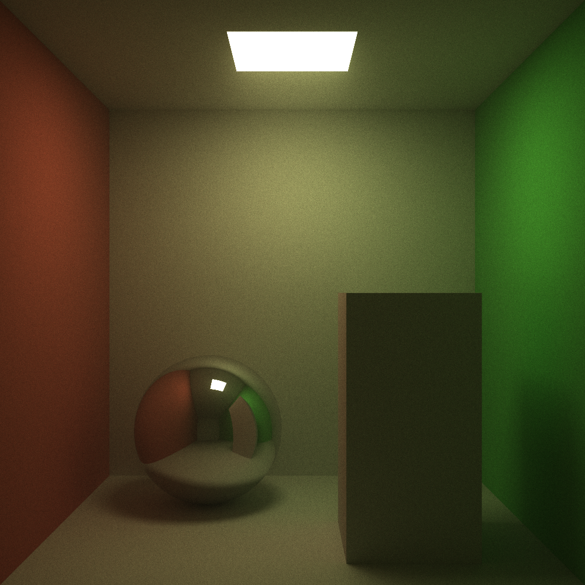
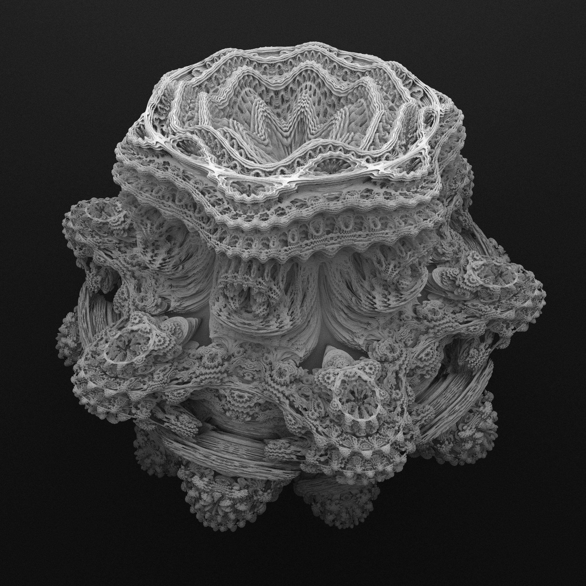

# Raytracer
</img>
</img>

This is a small modular raytracer written in C++. Along with the usual suspects, it includes SSE optimized sphere intersection calculation, raymarched implementation of the [mandelbulb fractal](https://en.wikipedia.org/wiki/Mandelbulb) and a portable JSON scene representation format.

To compile and run the raytracer locally, first install [nlohmann/json](https://github.com/nlohmann/json) and then execute the bash file:
```bash
run.sh
```

To run in interactive mode (window + sample doubling), also install [SFML/SFML](https://github.com/SFML/SFML) and instead execute the bash file:
```bash
run_interactive.sh
```
In interactive mode, pressing the `Enter` key doubles the sample count. 


Scenes are described in a JSON format:<br>
(full example [config.json](./config.json))
```json
{
    "width": 500,
    "height": 250,
    "fov": 60,
    "aspect_ratio": 2,
    "cam_origin": [0.0, 0.0, 0.0],
    "cam_at": [0.0, 0.0, -1],
    "sky_gradient": [[0.0, 0.0, 0.0], [0.0, 0.0, 0.0]],

    "n_threads": 4,
    "samples": 10,
    "max_bounces": 50,
    "fog_factor": 0.2,

    "objects": [
        {
            "type": "sphere",
            "pos": [-0.6, 0.0, -2.0],
            "radius": 0.5,
            "props": {
                "smooth": 0.0,
                "color": [0.8, 0.2, 0.2],
                "glow": 0.0,
                "reflect": 0.5
            }
        },
        ...
        {
            "type": "cuboid",
            "pos": [0.0, -0.5, -2.25],
            "w": 0.25,
            "h": 0.25,
            "d": 0.25,
            "props": {
                "smooth": 0.0,
                "color": [0.2, 0.4, 0.8],
                "glow": 0.0,
                "reflect": 0.5
            }
        }
    ]
}
```
