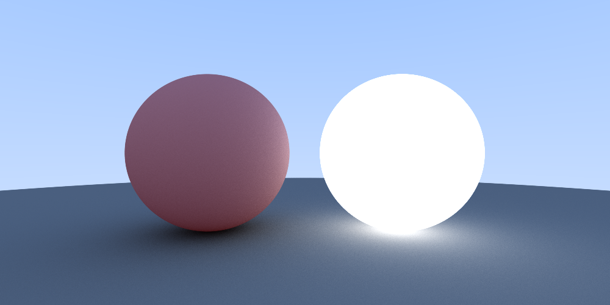

# Raytracer

</img>

To compile and run the raytracer locally, you can execute the bash file:
```bash
run.sh
```
The scene is described in the [main.cpp](./main.cpp) file:
```cpp
...

Scene scene = Scene(1e3);
scene.add_sphere(point3{-0.6, 0, -2}, 0.5, color{1, 0, 0}, 0.2);
scene.add_sphere(point3{0, -100.5, -2}, 100, color{0, 1, 0}, 0.0);
scene.add_sphere(point3{0.6, 0.0, -2}, 0.5, color{1, 1, 1}, 1.2);

...
```
The description above creates the example image.
