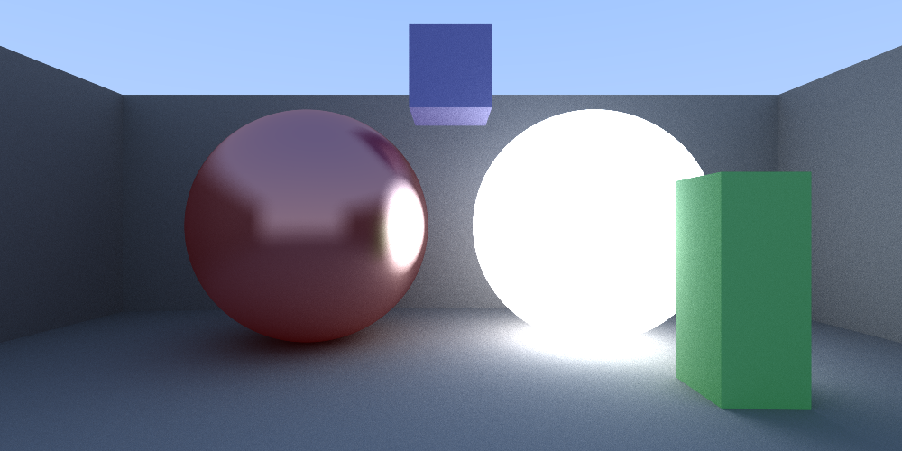

# Raytracer

</img>

To compile and run the raytracer locally, you can execute the bash file:
```bash
run.sh
```
The example scene is described in the [main.cpp](./main.cpp) file:
```cpp
...

Scene scene = Scene(1e3);

Props matte = Props(0.0, {0.0, 0.0, 0.0}, 0.2);
Props light = matte.glowed(2.5);
Props mirror = Props(0.8, {0.0, 0.0, 0.0}, 0.15, 0.5);

scene.add_sphere(point3{-0.6, 0, -2}, 0.5, mirror.colored({1, 0, 0}));
scene.add_sphere(point3{0, -100.5, -2}, 100, matte);
scene.add_sphere(point3{0.6, 0, -2}, 0.5, light.colored({1, 1, 1}));

scene.add_rectangle(point3{-2.0, -0.7, -2.75}, 4, 1.5, z_side, matte);
scene.add_rectangle(point3{-2.0, -0.7, -2.75}, -4, 1.5, x_side, matte);
scene.add_rectangle(point3{2.0, -0.7, -2.75}, -4, 1.5, x_side, matte);

scene.add_cuboid(point3{0.75, -0.6, -1.5}, 0.25, 0.75, 0.25, matte.colored({0, 1, 0}));
scene.add_cuboid(point3{-0.175, 0.5, -2.25}, 0.35, 0.35, 0.35, matte.colored({0, 0, 1.0}));

...
```
